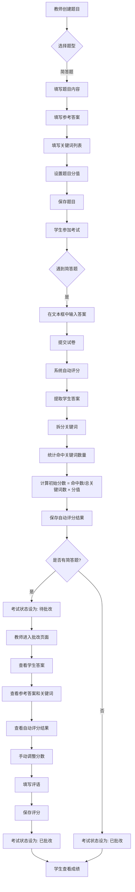

# 简答题功能流程图

## 简答题从出题到评分完整流程

## 流程说明

### 1. 出题阶段
- 教师在题目管理页面选择"简答题"题型（type=4）
- 填写题目内容、参考答案、关键词列表（逗号分隔）
- 设置题目分值
- 保存题目到数据库

### 2. 答题阶段
- 学生进入考试页面，系统根据题型渲染不同的答题组件
- 简答题显示多行文本输入框
- 学生在文本框中输入答案
- 提交试卷时收集所有题目答案

### 3. 自动评分阶段
- 系统提取学生答案和题目关键词
- 拆分关键词列表，去除空格
- 遍历每个关键词，检查学生答案中是否包含
- 统计命中关键词数量
- 计算初始分数：`(命中数 / 总关键词数) × 题目分值`
- 保存自动评分结果和命中数

### 4. 状态流转
- 考试包含简答题 → 提交后状态设为"待批改"（status=1）
- 考试不包含简答题 → 提交后状态设为"已批改"（status=2）

### 5. 手动评分阶段
- 教师在考试记录页面看到"待批改"状态的记录
- 点击"批改"按钮进入评分页面
- 查看学生答案、参考答案、关键词、自动评分结果
- 手动调整分数（不超过题目分值）
- 可选填写评语
- 保存评分后考试状态更新为"已批改"（status=2）

### 6. 成绩查看
- 学生在考试记录中查看最终成绩
- 包含所有题目的得分和简答题评语

## 核心数据结构

### Question 实体新增字段
- `type`: 题型（4表示简答题）
- `referenceAnswer`: 参考答案
- `keywords`: 关键词列表（逗号分隔）

### AnswerRecord 实体新增字段
- `autoScore`: 自动评分分数
- `matchedKeywords`: 命中关键词数量
- `comment`: 教师评语

### ExamRecord 状态字段
- `status`: 考试状态（0-进行中，1-待批改，2-已批改）
