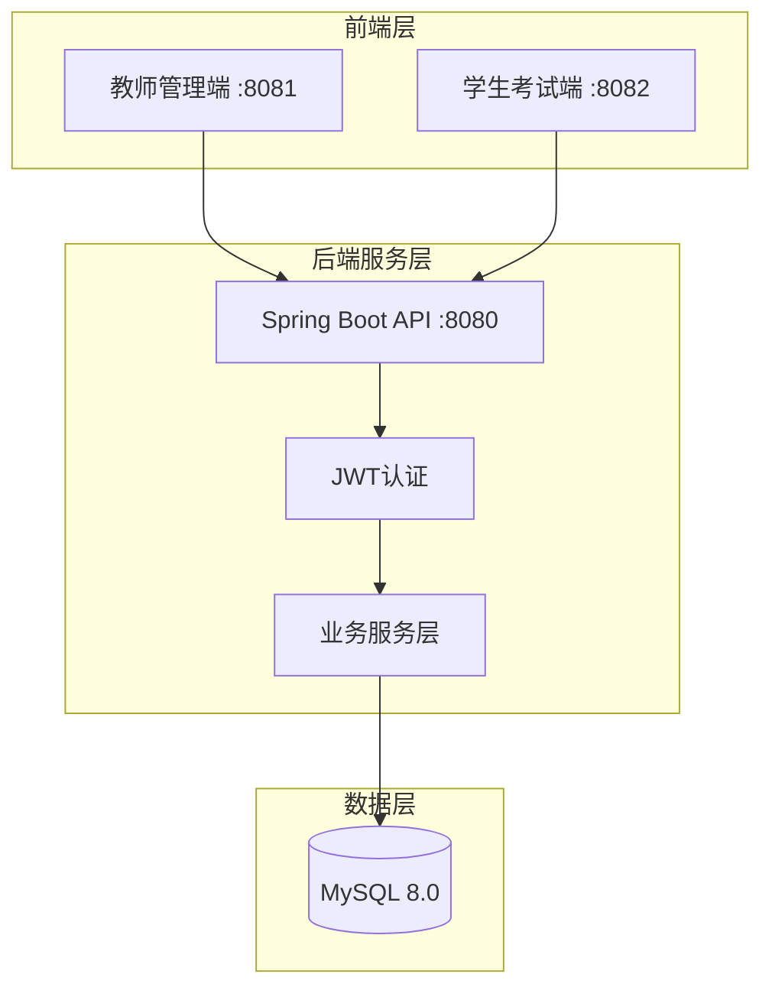
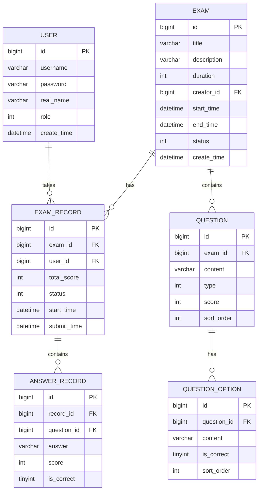

# 线上考试系统 - 项目设计文档

## 1. 系统架构

## 2. ER 图

## 3. 接口清单

### AuthController - 认证模块
| Method | Path | Description |
|--------|------|-------------|
| POST | /api/auth/login | 用户登录 |
| POST | /api/auth/logout | 用户登出 |
| GET | /api/auth/info | 获取当前用户信息 |

### ExamController - 考试管理
| Method | Path | Description |
|--------|------|-------------|
| GET | /api/exam/list | 获取考试列表 |
| GET | /api/exam/{id} | 获取考试详情 |
| POST | /api/exam | 创建考试 |
| PUT | /api/exam/{id} | 更新考试 |
| DELETE | /api/exam/{id} | 删除考试 |
| POST | /api/exam/{id}/publish | 发布考试 |

### QuestionController - 题目管理
| Method | Path | Description |
|--------|------|-------------|
| GET | /api/question/exam/{examId} | 获取考试题目列表 |
| POST | /api/question | 添加题目 |
| PUT | /api/question/{id} | 更新题目 |
| DELETE | /api/question/{id} | 删除题目 |

### ExamRecordController - 考试记录
| Method | Path | Description |
|--------|------|-------------|
| POST | /api/record/start/{examId} | 开始考试 |
| POST | /api/record/submit | 提交答卷 |
| GET | /api/record/my | 我的考试记录 |
| GET | /api/record/exam/{examId} | 考试成绩列表(教师) |
| GET | /api/record/{id}/detail | 答卷详情 |

## 4. UI/UX 规范

### 色彩系统
- 主色调: #409EFF (Element Plus 默认蓝)
- 成功色: #67C23A
- 警告色: #E6A23C
- 危险色: #F56C6C
- 背景色: #F5F7FA
- 卡片背景: #FFFFFF
- 文字主色: #303133
- 文字次色: #606266

### 字体规范
- 主字体: -apple-system, BlinkMacSystemFont, 'Segoe UI', Roboto, 'Helvetica Neue', Arial
- 标题字号: 20px / 18px / 16px
- 正文字号: 14px
- 辅助字号: 12px

### 间距规范
- 页面边距: 24px
- 卡片内边距: 20px
- 元素间距: 16px / 12px / 8px

### 圆角规范
- 卡片圆角: 8px
- 按钮圆角: 4px
- 输入框圆角: 4px
